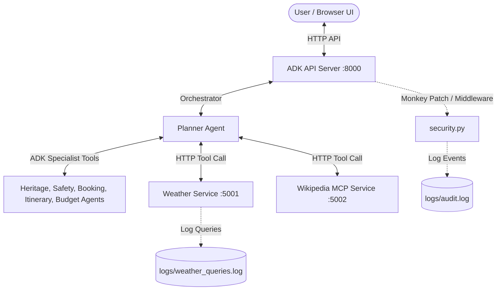

# YatraSetu AI Travel Companion - MCP Services & Hardening

This project integrates two external Model Context Protocol (MCP) style services and comprehensive security features into the YatraSetu Travel Agent System.

---

## 1. Architecture Overview



### A. Weather Service (`planner_mcp_weather/`)
- **Port**: `5001`
- Exposes a `GET /weather` endpoint.
- Returns curated weather profiles (temperature ranges, rainfall, best travel seasons, packing guidance, and weather-driven itineraries) for five Indian destinations: **Delhi, Goa, Jaipur, Rajasthan, and Varanasi**.
- Logs all incoming queries to `logs/weather_queries.log`.

### B. Wikipedia MCP Service (`planner_mcp_wiki/`)
- **Port**: `5002`
- Exposes a `GET /wiki` endpoint.
- Queries the Wikipedia page summary API. If a direct match is not found, it automatically falls back to searching Wikipedia and retrieving the summary of the first search result.
- Returns the article title, a 300-character summary, full article URL, and extract.

### C. Security Hardening (`security.py`)
- Automatically monkey-patches the ADK `Runner` to intercept user inputs and agent outputs.
- Performs **SQL injection**, **prompt injection**, and **character length validation** on every query.
- Validates **budget bounds** (₹0 to ₹1 crore) and **duration bounds** (1 to 365 days).
- Cleans and sanitizes agent responses: redacts Google API keys, Bearer tokens, and database passwords, strips script/iframe/object tags to prevent XSS, and blocks responses leaking internal system paths or agent prompts.
- Tracks active sessions (1-hour timeout) and logs all transactions to `logs/audit.log`.

---

## 2. How to Run the Services

### Prerequisites
Activate the ADK virtual environment first:
```bash
cd yatrasetu-agents
# Windows:
.venv\Scripts\activate
# macOS/Linux:
source .venv/bin/activate
```

### Start the Weather Service
From the root of the project:
```bash
python planner_mcp_weather/server.py
```

### Start the Wikipedia Service
From the root of the project:
```bash
python planner_mcp_wiki/server.py
```

### Start the YatraSetu System
Start the ADK API server and Frontend using the PowerShell script or manually:
```bash
# Start ADK API Server
adk api_server --allow_origins http://localhost:8080 --auto_create_session .

# Start Web UI (runs python -m http.server 8080 inside web_ui/)
python -m http.server 8080 --directory web_ui
```

---

## 3. Example Tool Call / Response

### Weather Service
- **Request**:
  `GET http://localhost:5001/weather?destination=Jaipur&month=June`
- **Response**:
  ```json
  {
    "status": "success",
    "destination": "Jaipur",
    "queried_month": "June",
    "season_context": "Summer",
    "temperature_range": "25°C - 45°C",
    "weather_conditions": "Extremely hot, dry, and sunny. Heatwaves are common...",
    "best_visiting_season": "October to March (Winter)",
    "monsoon_season": "July to September",
    "packing_suggestions": "Light-colored loose cotton clothes, wide-brim hat, sunglasses...",
    "travel_advice": "Avoid outdoor sightseeing in the afternoon (12 PM - 4 PM)..."
  }
  ```

### Wikipedia MCP Service
- **Request**:
  `GET http://localhost:5002/wiki?destination=Taj+Mahal`
- **Response**:
  ```json
  {
    "status": "success",
    "title": "Taj Mahal",
    "summary": "The Taj Mahal is an ivory-white marble mausoleum on the south bank...",
    "url": "https://en.wikipedia.org/wiki/Taj_Mahal",
    "extract": "The Taj Mahal is an ivory-white marble mausoleum on the south bank of the Yamuna river..."
  }
  ```
